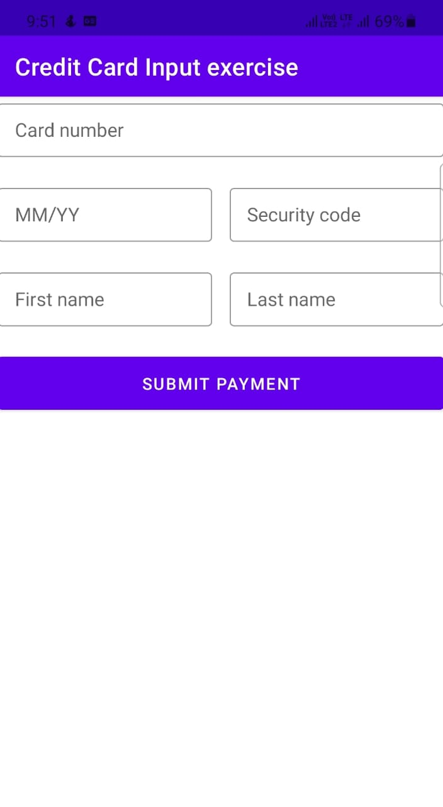
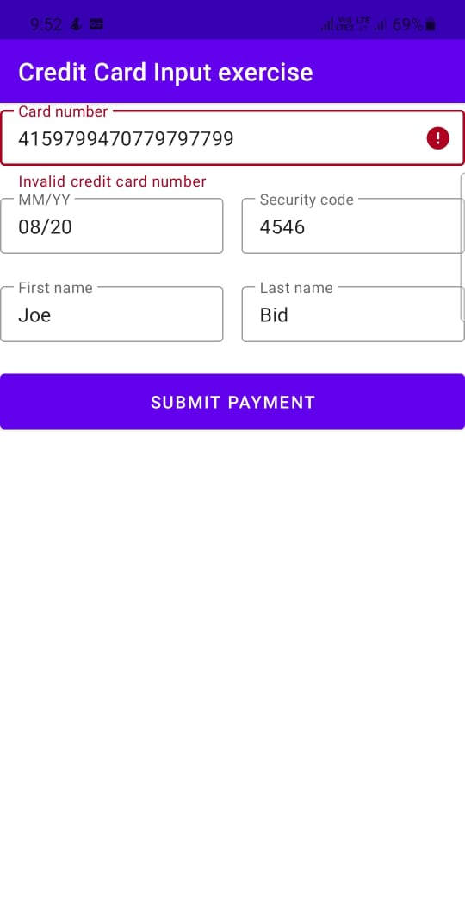

# Credit-Card-Input-Details-App
In this Android App , User have to fill  its all  credit card details,  if it is correctly ,  it shows a alet message that the payment is successfull.
 

# Technologies used:-
XML,Java,Android

Screenshots
-----------

